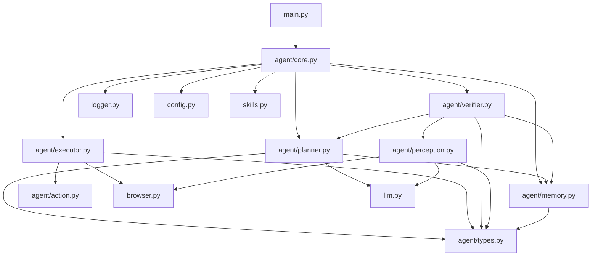

# ClassicWebAgent 项目设计方案

> 基于 `.agent/main.pdf` 项目开题报告，参考 browser-harness 轻量设计理念
> 设计日期：2026-06-10 | 修订：2026-06-13
> 关联细节文档：[模型调度方案](model-routing.md) | [感知模块设计](perception-design.md) | [审查报告](../.agent/review_report.md)

---

## 1. 设计原则

### 1.1 架构依据（项目规划书 §2.2）

本项目采用 **CoALA（Cognitive Architectures for Language Agents）** 作为总体架构组织方式：

| CoALA 层 | 职责 | 对应文件 |
|----------|------|---------|
| **记忆层 (Memory)** | 工作记忆、会话记忆 | [`agent/memory.py`](../src/classic_web_agent/agent/memory.py) |
| **动作空间 (Action Space)** | 外部动作（浏览器操作）、内部动作（检索/推理） | [`agent/action.py`](../src/classic_web_agent/agent/action.py) |
| **决策层 (Decision Cycle)** | 观察 → 规划 → 执行 → 验证 | [`agent/perception.py`](../src/classic_web_agent/agent/perception.py) [`agent/planner.py`](../src/classic_web_agent/agent/planner.py) [`agent/executor.py`](../src/classic_web_agent/agent/executor.py) [`agent/verifier.py`](../src/classic_web_agent/agent/verifier.py) |

执行流程采用 **ReAct 闭环**：观察 → 规划 → 执行 → 验证。ReAct 的此流程是 CoALA 决策循环（Observation → Proposal/Evaluation → Selection/Execution → Observation）的一种特化实现。

### 1.2 Python 项目规范

- **标准 src layout**：`src/classic_web_agent/` 包（PEP 517/518）
- **导入路径**：`from classic_web_agent.agent.core import Agent`
- **Python 版本**：`>=3.11`（与 browser-harness 等参考项目基线一致）

### 1.3 简化原则

- 目录深度 ≤ 3 层
- 每个模块优先单文件，仅在必要时拆分
- 不用 LangChain 等重型框架，Python + Playwright 直连
- 感知/浏览器/日志均合为单文件

### 1.4 双模型协作

LLM（大语言模型）与 VLM（视觉语言模型）分工协作——LLM 负责战略级粗粒度规划，VLM 负责战术级感知与执行。详细设计见 [模型调度方案](model-routing.md)。

---

## 2. 目录结构总览

```
ClassicWebAgent/                              # 项目根目录
│
├── src/                                      # 源码隔离层
│   └── classic_web_agent/                    # 🐍 主包（可 import）
│       ├── __init__.py
│       ├── __main__.py                       # `python -m classic_web_agent` → 委托 main()
│       ├── main.py                           # 唯一 CLI 入口 (argparse)
│       ├── config.py                         # 配置管理 (.env + config/config.json)
│       │
│       ├── agent/                            # 🤖 Agent 核心（CoALA + ReAct）
│       │   ├── __init__.py
│       │   ├── core.py                       # ReAct 主循环：observe→plan→execute→verify
│       │   ├── types.py                      # 数据模型：PageState / Action / ActionResult / MemoryEntry / AgentStep
│       │   ├── memory.py                     # 记忆层：工作记忆 + 会话记忆 + URL栈 + 上下文窗口管理
│       │   ├── action.py                     # 动作空间：16 外部 + 5 内部动作，详见 action-space.md
│       │   ├── planner.py                    # LLM 规划器：ReAct 风格逐步推理
│       │   ├── executor.py                   # 执行器：LLM输出 → Playwright 操作
│       │   ├── verifier.py                   # 验证器：动作效果检查 + 错误恢复（自愈）
│       │   └── perception.py                 # 👁️ 感知：VLM视觉 + DOM解析 + SoM + 融合 + 定位
│       │
│       ├── browser.py                        # 🌐 Playwright 驱动 + 原子操作
│       ├── llm.py                            # 🧠 LLM/VLM 客户端（OpenAI 兼容 API）
│       ├── logger.py                         # 📊 结构化日志 + JSONL轨迹 + 截图管理
│       └── skills.py                         # 🔧 Skill 库（阶段二扩展）
│
├── tests/                                    # 🧪 测试（后续按需添加）
│   └── __init__.py
│
├── config/                                   # ⚙️ 配置
│   ├── prompts/
│   │   ├── planner.yaml                      # ReAct 规划提示词
│   │   ├── verifier.yaml                     # 验证 + 恢复提示词
│   │   └── perception.yaml                   # VLM 感知提示词
│   └── config.json                           # Agent 全局配置
│
├── log/                                      # 📁 运行时输出（gitignore）
│   ├── trajectories/                         # JSONL 轨迹记录
│   └── screenshots/                          # 分步截图序列
│
├── scripts/                                  # 🔨 辅助脚本
│   ├── run.py                                # 开发辅助：加载 .env + 调用 main()
│   └── benchmark.py                          # 批量评测（阶段三）
│
├── docs/                                     # 📖 文档
│   ├── design.md                             # 本文件：主设计方案
│   ├── model-routing.md                      # 模型调度细节设计
│   └── architecture.md                       # 用户向架构概览
│
├── .agent/                                   # 🛠️ 开发期设计文档和分析报告
├── .vscode/
├── .env.example
├── .gitignore
├── pyproject.toml                            # Poetry 配置（含 packages/scripts）
├── poetry.lock
└── README.md
```

---

## 3. 模块依赖关系



`core.py` 是依赖枢纽，持有所有模块引用并编排 ReAct 闭环。`types.py` 无外部依赖，被所有模块引用，避免循环导入。`skills.py` 为阶段二扩展，与 core 弱关联。

---

## 4. 数据流（ReAct 单步）

```
1. OBSERVE ──→ perception.py ──→ PageState
     │              │
     │         VLM 截图分析 + DOM 解析 + 多模态融合
     │
2. PLAN    ──→ planner.py   ──→ Action
     │              │
     │         memory.py（上下文，含滑动窗口截断）
     │         llm.py（LLM 推理）
     │         prompts/planner.yaml
     │
3. EXECUTE ──→ executor.py  ──→ ActionResult
     │              │
     │         action.py（校验）
     │         browser.py（Playwright）
     │
4. VERIFY  ──→ verifier.py  ──→ success / retry / abort
                    │
              perception.py（重新观察）
              memory.py（记录结果 + 更新 URL 栈）
```

此为基础 ReAct 单步流程。在层级规划模式下（详见 [模型调度方案](model-routing.md)），PLAN 阶段由 LLM 一次性生成粗粒度步骤链，VLM 在每步内自行完成感知→决策→执行→验证的战术循环，仅在求救或步间审查时回调 LLM。

---

## 5. 文件职责摘要

| 文件 | 核心职责 | 阶段 |
|------|---------|------|
| [`main.py`](../src/classic_web_agent/main.py) | argparse CLI，唯一入口，解析任务，初始化并启动 Agent | 一 |
| [`config.py`](../src/classic_web_agent/config.py) | 加载 `.env` + `config/config.json`，全局配置单例 | 一 |
| [`agent/types.py`](../src/classic_web_agent/agent/types.py) | 数据模型：`PageState` `Action` `ActionResult` `MemoryEntry` `AgentStep`（dataclass） | 一 |
| [`agent/core.py`](../src/classic_web_agent/agent/core.py) | ReAct 闭环主循环 | 一 |
| [`agent/memory.py`](../src/classic_web_agent/agent/memory.py) | 工作记忆 + 会话记忆 + URL栈 + 上下文窗口滑动截断 + token 估算 | 一 |
| [`agent/action.py`](../src/classic_web_agent/agent/action.py) | 动作类型枚举 + 外部/内部动作定义 + 合法性校验 | 一 |
| [`agent/planner.py`](../src/classic_web_agent/agent/planner.py) | 构建 ReAct 上下文，调用 LLM 生成下一步动作 | 一 |
| [`agent/executor.py`](../src/classic_web_agent/agent/executor.py) | 解析 LLM 输出 → 调用 `browser.py` 执行 | 一 |
| [`agent/verifier.py`](../src/classic_web_agent/agent/verifier.py) | 状态比对 + 失败判断 + 自愈恢复（回退/重试/替代） | 二 |
| [`agent/perception.py`](../src/classic_web_agent/agent/perception.py) | VLM 截图分析 + CDP 增强 DOM 解析 + 元素定位；CDP 采集/解析 + Playwright 执行，详见 [感知模块设计](perception-design.md) | 一/二 |
| [`browser.py`](../src/classic_web_agent/browser.py) | Playwright 管理 + 原子操作（click/type/scroll/screenshot/js_eval）；截图使用 PIL optimize PNG 编码为 data URI | 一 |
| [`llm.py`](../src/classic_web_agent/llm.py) | OpenAI 兼容 API，LLM/VLM 双模式，统一重试/超时；VLM 图片输入统一使用 PIL optimize PNG 编码 | 一 |
| [`logger.py`](../src/classic_web_agent/logger.py) | 结构化日志 + JSONL 轨迹记录 + 分步截图保存 | 一 |
| [`skills.py`](../src/classic_web_agent/skills.py) | Skill 注册 + 按需加载 | 二 |
| [`scripts/run.py`](../scripts/run.py) | 开发辅助：自动加载 `.env`，调用 `main()` | 一 |
| [`scripts/benchmark.py`](../scripts/benchmark.py) | 批量评测运行器 | 三 |

---

## 6. 入口点设计

| 入口 | 用途 | 关系 |
|------|------|------|
| [`__main__.py`](../src/classic_web_agent/__main__.py) | `python -m classic_web_agent` | 仅 `from classic_web_agent.main import main; main()` |
| [`main.py`](../src/classic_web_agent/main.py) | 唯一 CLI 逻辑（argparse） | 定义 `main()` 函数 |
| [`scripts/run.py`](../scripts/run.py) | 开发辅助脚本 | 自动加载 `.env` + 调用 `main()`（不重复 CLI 逻辑） |

---

## 7. 关键配置文件

### 7.1 `config/config.json`

```json
{
  "agent": {
    "mode": "auto",
    "confidence_threshold": 0.9,
    "max_retry_per_step": 2,
    "planning": {
      "review_after_each_step": true
    }
  }
}
```

配置项说明详见 [模型调度方案 §8](model-routing.md#8-运行模式配置项)。

### 7.2 `pyproject.toml` 关键配置

```toml
[project]
name = "ClassicWebAgent"
requires-python = ">=3.11"

[tool.poetry]
packages = [{include = "classic_web_agent", from = "src"}]

[tool.poetry.scripts]
classic-web-agent = "classic_web_agent.main:main"
```

### 7.3 `config/prompts/` 模板

- **planner.yaml** — ReAct 规划提示词（Thought/Action/Observation），含 planning / review / recover 三套模板
- **verifier.yaml** — 验证 + 错误恢复提示词
- **perception.yaml** — VLM 感知提示词（页面语义 + 元素定位），要求输出 confidence + next_action + page_snapshot

---

## 8. 图片编码策略

### 8.1 截图 → VLM 传输协议

Playwright 截图（PNG）通过 **PIL (Pillow) optimize PNG** 编码为 base64 data URI 后传递给 VLM。

**理由**（基于环境测试结果）：
- PIL `save(format="PNG", optimize=True)` 可获得 **~6.9% 压缩率**，同时保持 VLM (mimo-v2.5) 识别成功率 100%
- JPEG 有损压缩对小截图（<50KB）因编码开销反而膨胀体积，不适用
- 原始文件直接 base64 无压缩，但 PIL optimize 零损失且减少传输 token
- mimo-v2.5 对 PIL 重新编码的 PNG 字节变化**不敏感**

**实现位置**：`browser.py` 截图后调用编码函数，生成 data URI 传递给 `llm.py` 的 VLM 调用。

---

## 9. 模型调度

LLM 与 VLM 的分工遵循 **战略与战术分离** 原则，支持三种运行模式（`auto` / `vlm_only` / `dual_model`），采用层级规划 + 三级路由 + 求救分级 + 步间审查的完整协作方案。详见 [模型调度方案](model-routing.md)。

---

## 10. 阶段规划与文件映射

| 阶段 | 对应文件 |
|------|---------|
| **阶段一**：最小可行系统 | `main.py` `config.py` `agent/types.py` `agent/core.py` `agent/memory.py` `agent/action.py` `agent/planner.py` `agent/executor.py` `agent/perception.py` `browser.py` `llm.py` `logger.py` `scripts/run.py`（13 文件） |
| **阶段二**：功能完善 | 丰富全部文件，新增 `agent/verifier.py` `skills.py`，增强 `agent/perception.py` |
| **阶段三**：实验评测 | `scripts/benchmark.py` + 持续优化 `config/prompts/` |

---

## 11. 参考资料

| 参考资料 | 关联设计 |
|---------|---------|
| **CoALA (2024)** | 总体架构：记忆层 + 动作空间 + 决策循环 |
| **ReAct** | 执行流程：Thought-Action-Observation 交替 |
| **Mind2Web (2023)** | 粗粒度规划 + 细粒度执行的分层思想 |
| **SeeAct (2024)** | 感知先行、按需推理——高置信度直行，低置信度调用 LLM |
| **V-GEMS / See and Remember (2026)** | 步骤完成后更新状态、重评估路径 |
| **WebVoyager (2024)** | VLM 直接输出动作（对应 vlm_only 模式） |
| **browser-harness** | Skill 库短路 + 自愈机制 |
| **BrowserAgent (2025)** | Playwright 原子操作设计 |

---

## 附录：文档导航

| 文档 | 位置 | 说明 |
|------|------|------|
| 本文件 | [`docs/design.md`](design.md) | 项目主设计方案 |
| 动作空间 | [`docs/action-space.md`](action-space.md) | 21 动作类型定义（16 外部 + 5 内部）、Playwright 映射、参考对比 |
| 感知模块设计 | [`docs/perception-design.md`](perception-design.md) | CDP 四流采集 + 增强 DOM 树 + 元素定位映射 + 输出格式 |
| 模型调度方案 | [`docs/model-routing.md`](model-routing.md) | LLM/VLM 协作、层级规划、三级路由细节 |
| 审查报告 | [`.agent/review_report.md`](../.agent/review_report.md) | 子代理设计审查（A- / 87分） |
| 用户向概述 | [`docs/architecture.md`](architecture.md) | 面向用户的架构概览 |
