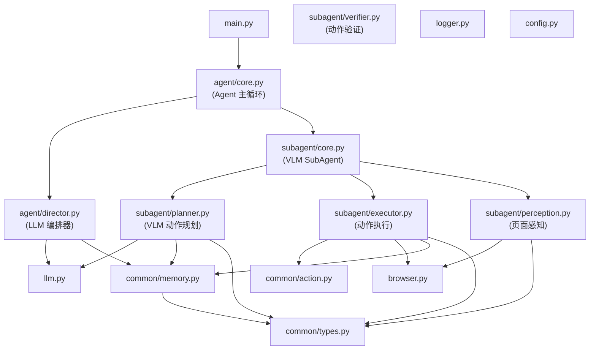

# ClassicWebAgent 项目设计方案

> 基于 `.agent/main.pdf` 项目开题报告，参考 browser-harness 轻量设计理念
> 设计日期：2026-06-10 | 修订：2026-06-13
> 关联细节文档：[模型调度方案](model-routing.md) | [感知模块设计](perception-design.md) | [审查报告](../.agent/review_report.md)

---

## 1. 设计原则

### 1.1 架构依据（项目规划书 §2.2）

本项目采用 **CoALA（Cognitive Architectures for Language Agents）** 作为总体架构组织方式：

| CoALA 层 | 职责 | 对应文件 |
|----------|------|---------|
| **记忆层 (Memory)** | 工作记忆、会话记忆 | [`common/memory.py`](../src/classic_web_agent/common/memory.py) |
| **动作空间 (Action Space)** | 外部动作（浏览器操作）、内部动作（检索/推理） | [`common/action.py`](../src/classic_web_agent/common/action.py) |
| **决策层 (Decision Cycle)** | LLM 调度 → SubAgent 自治执行 | [`agent/core.py`](../src/classic_web_agent/agent/core.py) + [`subagent/`](../src/classic_web_agent/subagent/) |

执行流程采用 **ReAct 闭环**：观察 → 规划 → 执行 → 验证。ReAct 的此流程是 CoALA 决策循环（Observation → Proposal/Evaluation → Selection/Execution → Observation）的一种特化实现。

### 1.2 Python 项目规范

- **标准 src layout**：`src/classic_web_agent/` 包（PEP 517/518）
- **导入路径**：`from classic_web_agent.agent.core import Agent`
- **Python 版本**：`>=3.11`（与 browser-harness 等参考项目基线一致）

### 1.3 简化原则

- 目录深度 ≤ 3 层
- 每个模块优先单文件，仅在必要时拆分
- 不用 LangChain 等重型框架，Python + Playwright 直连
- 感知/浏览器/日志均合为单文件

### 1.4 双模型协作

LLM（大语言模型）与 VLM（视觉语言模型）分工协作——LLM 负责战略级粗粒度规划，VLM 负责战术级感知与执行。详细设计见 [模型调度方案](model-routing.md)。

---

## 2. 目录结构总览

```
ClassicWebAgent/
│
├── src/
│   └── classic_web_agent/
│       ├── __init__.py, __main__.py
│       ├── main.py, config.py, llm.py, logger.py, browser.py, skills.py
│       │
│       ├── common/                           # 共享数据模型与逻辑
│       │   ├── types.py                      # 所有数据模型（Action/PageState/MemoryEntry...）
│       │   ├── memory.py                     # 三层记忆管理器
│       │   └── action.py                     # 动作类型枚举 + ActionSpace
│       │
│       ├── agent/                            # LLM 主代理
│       │   ├── core.py                       # Agent.run() 主循环
│       │   ├── director.py                   # 编排器：任务分解 + 子任务调度（暂为 stub）
│       │   └── __init__.py
│       │
│       └── subagent/                         # VLM 子代理
│           ├── core.py                       # SubAgent：子任务自治执行循环
│           ├── planner.py                    # VLM 动作规划（看图+DOM→动作序列）
│           ├── executor.py                   # 动作执行器（Action→Playwright）
│           ├── perception.py                 # 页面感知（CDP 采集+DOM 解析）
│           ├── verifier.py                   # 动作效果验证
│           ├── __init__.py
│           └── prompts/
│               └── planner.yaml              # VLM 动作规划提示词
│
├── config/
│   ├── config.json
│   └── prompts/
│       ├── perception.yaml
│       └── verifier.yaml
│
├── tests/
├── docs/
├── scripts/
├── logs/
└── ...
```

---

## 3. 模块依赖关系



LLM 和 VLM 通过 `SubAgent.run(sub_task) → observations` 接口通信。`common/` 中的 types/memory/action 被双方共享。

---

## 4. 数据流（双层架构）

```
用户任务
    │
    ▼
Agent.run(task)
    │
    ├── Director.create_plan(task)        ← LLM 分解子任务
    │       └── Plan(steps=[子任务1, 子任务2, ...])
    │
    ├── for each 子任务:
    │       │
    │       ▼
    │   SubAgent.run(sub_task)            ← VLM 自治执行
    │       │
    │       ├── Perception.observe()      → PageState
    │       ├── Planner.plan(state)       → Action 列表
    │       ├── Executor.execute(action)  → ActionResult
    │       └── ...循环直到 DONE/FAIL...
    │       │
    │       ▼
    │   observations → memory.observations
    │
    ├── Director.generate_report(task)    ← LLM 汇总报告
    │
    └── TaskResult
```

LLM 每次调用 `SubAgent.run()` 后，VLM 返回 observations 字符串。
observations 通过消息历史传递给 LLM 的上下文，因此 `knowledge` 暂不使用。

---

## 5. 文件职责摘要

| 文件 | 核心职责 | 阶段 |
|------|---------|------|
| [`common/types.py`](../src/classic_web_agent/common/types.py) | 数据模型：PageState/Action/ActionResult/MemoryEntry/KnowledgeItem... | 一 |
| [`common/memory.py`](../src/classic_web_agent/common/memory.py) | 三层记忆：observations(LLM 使用) + working(VLM 使用) + knowledge(预留) | 一 |
| [`common/action.py`](../src/classic_web_agent/common/action.py) | ActionType 枚举（21 个动作）+ ActionSpace 校验/去重 | 一 |
| [`agent/core.py`](../src/classic_web_agent/agent/core.py) | Agent 主循环，编排 Director + SubAgent 双层架构 | 一 |
| [`agent/director.py`](../src/classic_web_agent/agent/director.py) | LLM 编排器：任务分解 + 子任务调度 + 报告生成（stub） | 三 |
| [`subagent/core.py`](../src/classic_web_agent/subagent/core.py) | SubAgent：VLM 子任务自治执行循环 | 二 |
| [`subagent/planner.py`](../src/classic_web_agent/subagent/planner.py) | VLM 动作规划：加载 planner.yaml → 看图+DOM → Action 列表 | 二 |
| [`subagent/executor.py`](../src/classic_web_agent/subagent/executor.py) | Action → Playwright 原子操作（21 个动作路由） | 一 |
| [`subagent/perception.py`](../src/classic_web_agent/subagent/perception.py) | CDP 三流采集 + EnhancedDOMTree + 序列化 → PageState | 一/二 |
| [`subagent/verifier.py`](../src/classic_web_agent/subagent/verifier.py) | 动作效果验证（stub，待实现） | 二 |
| [`browser.py`](../src/classic_web_agent/browser.py) | Playwright 驱动 + 原子操作（click/type/scroll/screenshot/js_eval） | 一 |
| [`llm.py`](../src/classic_web_agent/llm.py) | OpenAI 兼容 API，LLM/VLM 双模式，统一重试/超时 | 一 |
| [`logger.py`](../src/classic_web_agent/logger.py) | 任务开始/步骤/结束日志 | 一 |
| [`skills.py`](../src/classic_web_agent/skills.py) | Skill 注册（预留） | 二 |
| [`main.py`](../src/classic_web_agent/main.py) | CLI 入口，初始化并启动 Agent | 一 |
| [`config.py`](../src/classic_web_agent/config.py) | 配置加载（.env + config.json） | 一 |
| [`scripts/run.py`](../scripts/run.py) | 开发辅助：自动加载 `.env`，调用 `main()` | 一 |
| [`scripts/benchmark.py`](../scripts/benchmark.py) | 批量评测运行器 | 三 |

---

## 6. 入口点设计

| 入口 | 用途 | 关系 |
|------|------|------|
| [`__main__.py`](../src/classic_web_agent/__main__.py) | `python -m classic_web_agent` | 仅 `from classic_web_agent.main import main; main()` |
| [`main.py`](../src/classic_web_agent/main.py) | 唯一 CLI 逻辑（argparse） | 定义 `main()` 函数 |
| [`scripts/run.py`](../scripts/run.py) | 开发辅助脚本 | 自动加载 `.env` + 调用 `main()`（不重复 CLI 逻辑） |

---

## 7. 关键配置文件

### 7.1 `config/config.json`

```json

```

配置项说明详见 [模型调度方案 §8](model-routing.md#8-运行模式配置项)。

### 7.2 `pyproject.toml` 关键配置

```toml
[project]
name = "ClassicWebAgent"
requires-python = ">=3.11"

[tool.poetry]
packages = [{include = "classic_web_agent", from = "src"}]

[tool.poetry.scripts]
classic-web-agent = "classic_web_agent.main:main"
```

### 7.3 `config/prompts/` 模板

- **planner.yaml** — ReAct 规划提示词（Thought/Action/Observation），含 planning / review / recover 三套模板
- **verifier.yaml** — 验证 + 错误恢复提示词
- **perception.yaml** — VLM 感知提示词（页面语义 + 元素定位），要求输出 confidence + next_action + page_snapshot

---

## 8. 图片编码策略

### 8.1 截图 → VLM 传输协议

Playwright 截图（PNG）通过 **PIL (Pillow) optimize PNG** 编码为 base64 data URI 后传递给 VLM。

**理由**（基于环境测试结果）：
- PIL `save(format="PNG", optimize=True)` 可获得 **~6.9% 压缩率**，同时保持 VLM (mimo-v2.5) 识别成功率 100%
- JPEG 有损压缩对小截图（<50KB）因编码开销反而膨胀体积，不适用
- 原始文件直接 base64 无压缩，但 PIL optimize 零损失且减少传输 token
- mimo-v2.5 对 PIL 重新编码的 PNG 字节变化**不敏感**

**实现位置**：`browser.py` 截图后调用编码函数，生成 data URI 传递给 `llm.py` 的 VLM 调用。

---

## 9. 模型调度

LLM 与 VLM 的分工遵循 **调用者与被调用者分离** 原则：

- **LLM（Director）**：负责任务分解和子任务调度，不操作浏览器
- **VLM（SubAgent）**：自治执行子任务，通过 `SubAgent.run(sub_task) → observations` 接口返回结果

LLM 通过持久对话上下文维护任务状态，VLM 的 observations 在消息历史中自明。

详见 [模型调度方案](model-routing.md)。

---

## 10. 阶段规划与文件映射

| 阶段 | 对应文件 |
|------|---------|
| **阶段一**（✅ 完成） | Infrastructure：Browser, LLMClient, Perception, Executor, Memory + 目录重构 |
| **阶段二**（✅ 完成） | SubAgent 自治执行循环 + VLM Planner |
| **阶段三**（进行中） | LLM Director：任务分解 + 子任务调度 + 报告生成 |
| **阶段四** | 完整 LLM ↔ VLM 双层架构 + 多 VLM 并行 |

---

## 11. 参考资料

| 参考资料 | 关联设计 |
|---------|---------|
| **CoALA (2024)** | 总体架构：记忆层 + 动作空间 + 决策循环 |
| **ReAct** | 执行流程：Thought-Action-Observation 交替 |
| **Mind2Web (2023)** | 粗粒度规划 + 细粒度执行的分层思想 |
| **SeeAct (2024)** | 感知先行、按需推理——高置信度直行，低置信度调用 LLM |
| **V-GEMS / See and Remember (2026)** | 步骤完成后更新状态、重评估路径 |
| **WebVoyager (2024)** | VLM 直接输出动作（对应 vlm_only 模式） |
| **browser-harness** | Skill 库短路 + 自愈机制 |
| **BrowserAgent (2025)** | Playwright 原子操作设计 |

---

## 附录：文档导航

| 文档 | 位置 | 说明 |
|------|------|------|
| 本文件 | [`docs/design.md`](design.md) | 项目主设计方案 |
| 动作空间 | [`docs/action-space.md`](action-space.md) | 21 动作类型定义（16 外部 + 5 内部）、Playwright 映射、参考对比 |
| 感知模块设计 | [`docs/perception-design.md`](perception-design.md) | CDP 四流采集 + 增强 DOM 树 + 元素定位映射 + 输出格式 |
| 模型调度方案 | [`docs/model-routing.md`](model-routing.md) | LLM/VLM 协作、层级规划、三级路由细节 |
| 审查报告 | [`.agent/review_report.md`](../.agent/review_report.md) | 子代理设计审查（A- / 87分） |
| 用户向概述 | [`docs/architecture.md`](architecture.md) | 面向用户的架构概览 |
