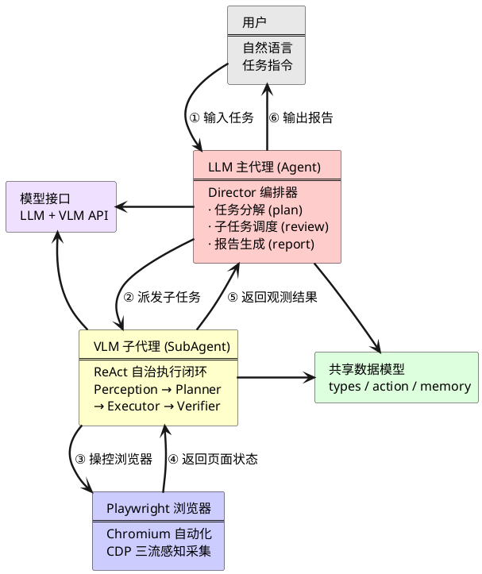
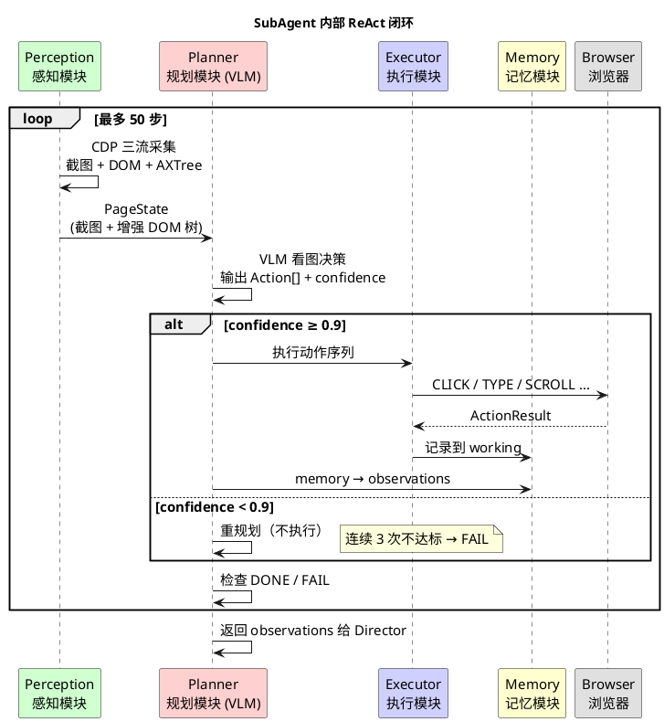

# ClassicWebAgent UML 图集

> 在 `.vscode/settings.json` 中添加以下配置即可在 VS Code 中预览：
> ```json
> "markdown-preview-enhanced.plantumlServer": "https://kroki.io/plantuml/svg/"
> ```

---

## 图 1：系统架构总览



---

## 图 2：ReAct 执行闭环


