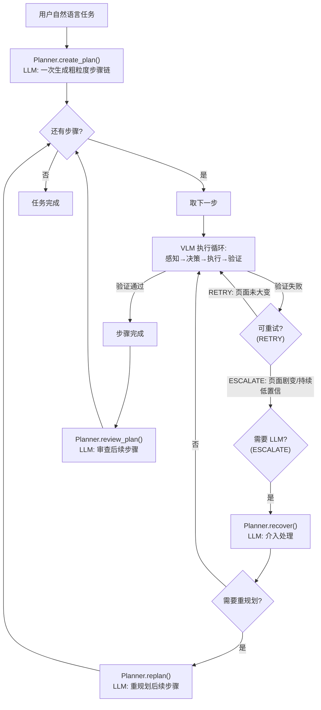

# 模型调度方案：LLM/VLM 协作与层级规划路由

> 设计日期：2026-06-11 | 修订：2026-06-13
> 关联文档：[主设计方案](design.md) | [动作空间设计](action-space.md) | [感知模块设计](perception-design.md)
> 状态：设计阶段，尚未实现代码

---

## 1. 核心思想：战略与战术分离

LLM 与 VLM 的分工不是"每一步"的交替，而是**战略与战术的分离**：

```
LLM 层（战略规划，低频调用）:
  用户任务 → 粗粒度步骤链 → [步1, 步2, 步3, ...]
                               │
VLM 层（战术执行，高频调用）:
  步 i → 感知→决策→执行→验证 循环 → 完成 / 求救
                                          │
                              ┌───────────┴───────────┐
                         步完成                    低置信度/验证失败
                            │                           │
                      LLM 更新后续计划              LLM 介入处理
```

**LLM 调用次数**从"每步 1 次"降为"每粗粒度步骤约 0.1~0.3 次"（仅在规划、求救、审查时调用）。

---

## 2. 架构总览



---

## 3. LLM 层：粗粒度规划

### 3.1 步骤粒度定义

粗粒度步骤定义为 **"单页面内的子目标"**。过粗会导致 VLM 在长链中迷失，过细则退化为每步调 LLM。

**示例**：
```
任务: "在京东搜索 iPhone 15 并加入购物车"

LLM 产出步骤链:
  步骤1: 打开京东首页                       ← 导航
  步骤2: 搜索 "iPhone 15" 并进入结果页       ← 单页面内完整操作
  步骤3: 找到第一个商品并加入购物车           ← 可能跨子页面
  步骤4: 确认购物车中有该商品                 ← 验证
```

步骤2 由 VLM 自行完成：识别搜索框 → 输入 → 点击搜索 → 等待加载。这些是"动作自明"的操作，无需 LLM 参与。

### 3.2 PlanStep 数据结构

每个粗粒度步骤包含以下字段：

- **id**：步骤序号
- **goal**：本步骤目标（自然语言描述）
- **fallback**：自救提示——VLM 执行失败时先尝试此策略，失败再呼叫 LLM
- **status**：`pending` / `active` / `completed` / `failed`

Plan 为步骤链的容器，聚合 `PlanStep` 列表，提供 `current_step` 和 `remaining_steps` 便捷访问属性。

### 3.3 步骤链 vs 步骤树

| 方式 | 优点 | 缺点 |
|------|------|------|
| 链 + LLM 动态修复 | 简单，与"失败→调 LLM"天然吻合 | LLM 介入时需传足够上下文 |
| 树（预埋分支） | LLM 少调一次 | 预判所有分支困难；树爆炸 |

采用 **链 + fallback**：每个 `PlanStep` 带 `fallback` 字段，VLM 先自救，自救失败再呼叫 LLM。

---

## 4. VLM 层：战术执行循环

### 4.1 概述

VLM 执行层负责单个粗粒度步骤内的感知→决策→执行→验证循环。每次循环调用 VLM 观察当前页面状态（截图 + DOM 结构），做出原子动作决策，交由 Executor 执行，再由 Verifier 验证结果。

### 4.2 求救分级

VLM 执行失败时区分两个级别：

| 级别 | 触发条件 | 处理方式 |
|------|---------|---------|
| **RETRY** | 验证失败但页面结构未大变（URL 相同、主要元素仍在） | VLM 自行重试 1~2 次，不调用 LLM |
| **ESCALATE** | 页面跳转到意外 URL / 连续 2 次 RETRY 失败 / 置信度持续 < 0.5 | 调用 `Planner.recover()` 请求 LLM 介入 |

RETRY 与 ESCALATE 的分级避免了"页面轻微变动就呼叫 LLM"的低效，又保证了"页面剧变或持续低置信"时能及时获得 LLM 的高层次推理支持。

### 4.3 三级决策路由

VLM 执行层每次做动作决策时，按以下优先级判断：

**Level 1 — 动作自明（confidence ≥ 阈值，默认 0.9）**

VLM 对当前页面状态有高度把握，直接输出下一步动作，跳过 Planner（LLM）。仅消耗 1 次 VLM API 调用。典型场景：搜索框已定位，直接键入关键词；明确的"下一步"按钮已高亮。

**Level 2 — Skill 匹配（页面模式命中已知 Skill）**

VLM 识别出当前页面匹配已知的 Skill 模式（如"百度搜索页"、"通用登录页"），复用预定义的交互流程，跳过 Planner。仅消耗 1 次 VLM API 调用用于页面模式识别。Skill 库在阶段二实现。

**Level 3 — 需要推理（以上均不满足）**

VLM 判断当前情况复杂、置信度不足，或 Level 1/2 均失败。此时触发 ESCALATE，调用 LLM（Planner）进行高层次推理。消耗 1 次 VLM + 1 次 LLM API 调用。典型场景：面对多个可能路径需要分析选择；页面布局与预期偏差较大。

**路由回退规则**：Level 1 失败后直接回退到 Level 3（ESCALATE），不在 Level 1 内反复重试。Level 2 匹配失败同理。

---

## 5. 步间上下文：StepSummary 与 PageSnapshot

每一步完成后，LLM 需要了解"发生了什么"才能审查和更新后续计划。步间上下文由两个数据结构承载：

### 5.1 PageSnapshot — 页面结构化快照

精简的页面状态描述，用于在 LLM 层传递页面信息（而非传递完整截图）：

- **url**：当前页面 URL
- **title**：页面标题
- **key_elements**：页面主要交互元素摘要列表（如 `["搜索框", "登录按钮", "导航栏"]`）
- **visible_text_summary**：页面可见文本摘要（截取前约 500 字符）

### 5.2 StepSummary — 步骤完成摘要

聚合一个粗粒度步骤的完整执行记录：

- **step_id** / **goal**：对应 PlanStep 的标识和目标
- **status**：`"completed"` / `"partial"` / `"failed"`
- **start_snapshot**：步骤开始时的页面快照（可选）
- **end_snapshot**：步骤结束时的页面快照
- **key_observations**：VLM 总结的步骤期间关键变化列表
- **actions_taken**：本步骤内执行的原子动作总数
- **confidence_trace**：各子动作的置信度序列（如 `[0.95, 0.92, 0.88, 0.91, 0.50, 0.45]`）
- **error_description**：失败原因描述（status 为 failed 时）

### 5.3 置信度轨迹的价值

`confidence_trace` 的作用不止于事后诊断。LLM 审查时如果发现置信度逐步下降的趋势（如从 0.95 逐步滑落到 0.45），可以提前对后续步骤做出调整——例如拆分为更小的子步骤、或增加验证检查点——而不等到真正失败。

---

## 6. Planner 角色扩展

为实现层级规划，`Planner` 从单一的"每步生成动作"扩展为四个职责明确的方法：

| 方法 | 调用时机 | 职责 |
|------|---------|------|
| `create_plan(task, memory)` | 任务开始 | LLM 一次性分析任务，生成粗粒度步骤链（`Plan`） |
| `recover(observation, step, memory)` | VLM ESCALATE 求救 | LLM 分析当前页面状态和步骤目标，给出恢复动作或判定需要重规划 |
| `replan(observation, memory)` | `recover()` 判定需重规划 | LLM 基于当前页面状态，重新生成从当前位置到任务完成的剩余步骤链 |
| `review_plan(plan, summary, memory)` | 每个步骤完成后 | LLM 根据步骤结果审查后续步骤的合理性，必要时调整顺序、合并或拆分 |

---

## 7. 运行模式

系统支持三种运行模式，通过 `config.json` 中的 `agent.mode` 配置：

### 7.1 `auto`（推荐）

完整的层级规划模式：
- 任务开始 → LLM 生成粗粒度步骤链（`create_plan`）
- 每步由 VLM 自行执行，仅在求救时回调 LLM
- 每步完成后 LLM 审查后续计划（`review_plan`）
- 效率与精度平衡，适用于通用任务

### 7.2 `vlm_only`

完全不调用 LLM：
- 跳过 `create_plan`——将整个任务视为单个粗粒度步骤
- VLM 内部始终走 Level 1（动作自明），无法决策时直接失败
- 适用于简单任务、低成本运行、快速原型验证

### 7.3 `dual_model`

保留兼容的传统双模型模式：
- 每步都调用 VLM 感知 + LLM 规划
- 不做层级优化，不做步间审查
- 适用于对照实验、精度优先场景

---

## 8. 运行模式配置项

| 配置项 | 类型 | 说明 |
|--------|------|------|
| `agent.mode` | `str` | 运行模式：`"auto"` / `"dual_model"` / `"vlm_only"` |
| `agent.confidence_threshold` | `float` | Level 1 动作自明触发阈值 |
| `agent.max_retry_per_step` | `int` | RETRY 最大次数，超过后触发 ESCALATE |
| `agent.planning.review_after_each_step` | `bool` | 完成一步后是否调用 LLM 审查后续计划 |

---

## 9. 与参考资料的对齐

| 参考资料 | 本方案对应点 |
|---------|------------|
| **CoALA (2024)** | LLM 层对应 Decision Cycle（Proposal/Evaluation），VLM 层对应 Observation + Selection/Execution |
| **ReAct** | VLM 执行循环保留 Thought-Action-Observation 交替 |
| **Mind2Web (2023)** | "粗粒度规划 + 细粒度执行"的分层设计 |
| **SeeAct (2024)** | "感知先行，按需推理"——VLM 高置信度直行，低置信度调 LLM（Level 1 → Level 3） |
| **V-GEMS / See and Remember (2026)** | 步骤完成后更新状态、重评估路径（`review_plan`）；URL 栈与 `PageSnapshot` |
| **WebVoyager (2024)** | VLM 直接输出动作——对应 Level 1 和 vlm_only 模式 |
| **browser-harness** | Skill 库短路（Level 2）+ 自愈机制（RETRY / ESCALATE 分级） |

---

## 10. 实施建议

| 阶段 | 实施内容 |
|------|---------|
| **阶段一** | `mode: "vlm_only"`——最简单的端到端闭环（VLM 看图→出动作→执行→验证，不调 LLM），产出可演示的最小闭环系统 |
| **阶段二** | `mode: "dual_model"`——引入 Planner，VLM 感知 + LLM 每步规划，建立对照基线 |
| **阶段三** | `mode: "auto"`——实现层级规划 + 三级路由 + 求救分级 + 步间审查 |

---

## 11. 已确认决策总结

| 事项 | 决策 |
|------|------|
| 粗粒度步骤粒度 | **单页面内子目标**；LLM 产出步骤链 + fallback（不预埋分支树） |
| `confidence_threshold` 默认值 | **0.9**，可通过 `config.json` 调整 |
| Level 1 失败后策略 | **回退到 Level 3**（ESCALATE → `Planner.recover()`），不重试 Level 1 |
| RETRY / ESCALATE 分级 | RETRY ≤ 2 次（页面未大变）；超过则 ESCALATE |
| 步间上下文 | 每步完成后传递 `StepSummary`（含 `start_snapshot` / `end_snapshot` / `confidence_trace`） |
| LLM 步后审查 | 默认开启（`planning.review_after_each_step: true`） |
| CLI 参数覆盖 | **不需要**，`config.json` 配置即可 |
| 目录结构 | **零变更** |
